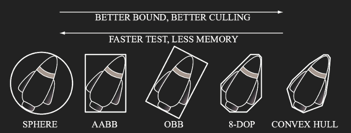
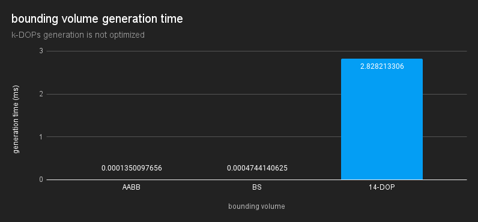
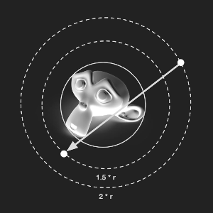
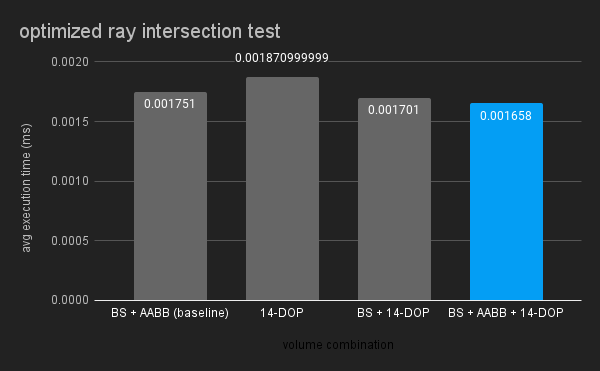
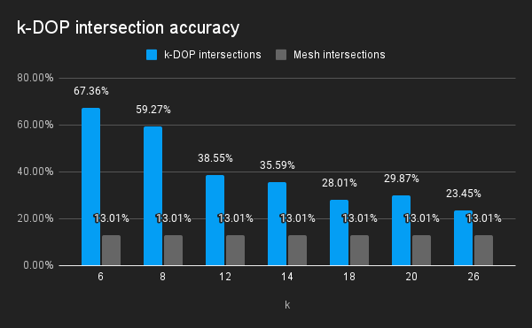
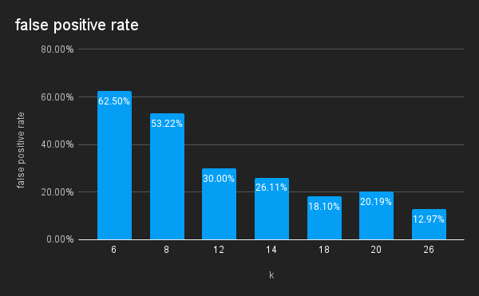

<!DOCTYPE html>
<html lang="en">
<head>
    <meta charset="UTF-8">
    <meta name="viewport" content="width=device-width, initial-scale=1.0">
    <title>three-kdop about</title>
    
    <link rel="stylesheet" type="text/css" href="./files/page.css" />
</head>
<body>

### see [examples](./examples/)

# k-DOPs in Three.js

> This Project was part of the [3D Computer Graphics: Extending the Three.js Seminar](https://hpi.de/studium/im-studium/lehrveranstaltungen/it-systems-engineering-ma/lehrveranstaltung/wise-23-24-3847-3d-computer-graphics-extending-the-threejs-framework.html) at Hasso Plattner Institute. Participants of this seminar explored how common Computer Graphics concepts still missing from the [Three.js](https://threejs.org/) library can be implemented.

<ul>
    <li><a href="#introduction">Introduction</a></li>
    <li><a href="#bounding-volumes-in-threejs">Bounding Volumes (in Three.js)</a></li>
    <li><a href="#using-k-dops">Using k-DOPs</a>
        <ul>
            <li><a href="#k-dop-helper">k-DOP Helper</a></li>
        </ul>
    </li>
    <li><a href="#performance">Performance</a>
        <ul>
            <li><a href="#kdop-creation">Kdop creation</a></li>
            <li><a href="#choosing-k">Choosing k</a></li>
        </ul>
    </li>
</ul>

## Introduction

Bounding volumes offer efficient intersection tests for 3D objects. They help optimize tasks like rendering, physics, and user interaction. Although Three.js includes several types of bounding volumes, it currently lacks support for k-DOPs. This project aims to explore how k-DOPs can be integrated into Three.js and compares their performance with other bounding volumes.

## Bounding Volumes (in Three.js)

Bounding volumes serve as simplified geometric shapes that envelop complex 3D objects. They completely contain the underlying geometry. By approximating geometry in this way, intersection tests can be made more efficient. Choosing the right kind of bounding volume is a tradeoff between faster intersection tests and a closer bound.

[source](https://www.researchgate.net/profile/Gang-Mei-2/publication/272093426_RealModel-a_system_for_modeling_and_visualizing_sedimentary_rocks/links/54ebe4a80cf2a03051950cba/RealModel-a-system-for-modeling-and-visualizing-sedimentary-rocks.pdf)

In Three.js, these bounding volumes play a crucial role in various aspects of 3D rendering, physics simulations, and user interactions. By encapsulating objects within simple shapes such as spheres or boxes, Three.js optimizes tasks like collision detection and culling.

Three.js already implements [Bounding Spheres](https://threejs.org/docs/#api/en/math/Sphere) and [Axis-Aligned Bounding Boxes](https://threejs.org/docs/#api/en/math/Box3) in its core. Convex hulls are also available as an [addon](https://threejs.org/docs/#examples/en/math/convexhull/ConvexHull). However, as of now, k-DOPs are neither integrated into Three.js' core features nor available as an addon. This presents an opportunity for further development and expansion within the frameworks bounding volume options.

## using k-DOPs

The [KDOP] class implements a multitude of intersection tests, as well as functions for creating and updating k-DOPs.

A new k-DOP can be created by calling the DOP class' constructor with a valid k \[6, 8, 12, 14, 18, 20, or 26].
The k-DOP can then be extpanded with a point, an array of points, a BufferGeometry or a 3D Object.

### k-DOP Helper

Like the [Box3 Helper](https://threejs.org/docs/#api/en/helpers/Box3Helper), the k-DOP-Helper allows for quick visualization of k-DOPs. It renders the intersecting edges of all combinations of slabs. Alternatively a mesh representation of the k-DOP can be optained by calling the _getGeometry()_ on the _DOP_ class method.

## Performance

All test use the Suzanne model, better known as the blender monkey. It is a relatively small model with 505 vertices and 968 triangles. Since it is also concave, bounding volumes, which are always convex, cannot approximate it perfectly.

### Kdop creation

Creating a k-DOP involves iterating through all combinations of vertices and normals. For each combination, the dot product of the vertex and the normal is computed. Compared to the simple min/max and square root operations of AABBs and Bounding Spheres this is computationally intensive. In Additionally, the creation time scales linearly with the chosen k value.
optimized Raytest

Despite the high initial creation time, using k-DOPs is still worth it, because can be used to optimize raytest performance. When doing a raytest, three.js already employs bounding spheres and AABBs. Since the bounding volumes fully contain the geometry a ray that does not intersect the bounding volume can not intersect the mesh. This can be leveraged to discard rays, that would miss the object. Threejs tests the sphere intersection first, then aabb. By adding a kdop step, the number of false positive hits of the bounding volumes is reduced further. This leads to less ray-mesh intersection tests having to be executed and improves overall performance.

### Optimized Raytest

To ensure comparability across different experiments, a consistent kernel with 100,000 samples is utilized for all measurements. Rays are generated as follows:

1. The origin is obtained by sampling a point on the bounding sphere and multiplying it by a scalar of 2.

2. A target point is then sampled from the bounding sphere and multiplied by 1.5.

3. Subsequently, the ray is constructed using the origin point and the vector from the origin to the target point as the ray's direction.

Currently Three.js already optimizes the raytest by first testing for Bounding Sphere and then AABB intersection. Only if the ray intersects both Bounding Volumes is the Ray-Mesh intersection computed.

Fig # compares combinations of Bounding Volumes optimizations. 14 was chosen as the value of k, because it is middle of the line. Using solely the 14-DOP results in a slower intersection test on average. Combining Bounding Sphere and 14-DOP already outperforms the base case, but is improved even further by adding the AABB step in the middle.

### Choosing k

As k goes up, false positives go down
Comparison with convex hull generated through quick hull

</body>
</html>
