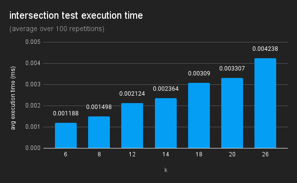
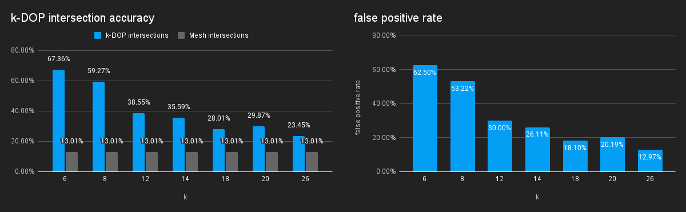

<!DOCTYPE html>
<html lang="en">
<head>
    <meta charset="UTF-8">
    <meta name="viewport" content="width=device-width, initial-scale=1.0">
    <title>three-kdop about</title>
    
    <link rel="stylesheet" type="text/css" href="./files/page.css" />
</head>
<body>

### &rarr; go to [examples](./examples/)

# k-DOPs in Three.js

<iframe width="560" height="315" src="https://www.youtube.com/embed/VJ_SrJQW2DA?si=faeelnkLpVS1kWY_" title="YouTube video player" frameborder="0" allow="accelerometer; autoplay; clipboard-write; encrypted-media; gyroscope; picture-in-picture; web-share" referrerpolicy="strict-origin-when-cross-origin" allowfullscreen style="margin-top: 48px;"></iframe>

> This Project was part of the [3D Computer Graphics: Extending the Three.js Seminar](https://hpi.de/studium/im-studium/lehrveranstaltungen/it-systems-engineering-ma/lehrveranstaltung/wise-23-24-3847-3d-computer-graphics-extending-the-threejs-framework.html) at Hasso Plattner Institute. Participants of this seminar explored how common computer graphics concepts still missing from the [Three.js](https://threejs.org/) library can be implemented.

<ul>
    <li><a href="#introduction">Introduction</a></li>
    <li><a href="#bounding-volumes-in-threejs">Bounding Volumes (in Three.js)</a></li>
    <li><a href="#using-k-dops">Using k-DOPs</a>
        <ul>
            <li><a href="#k-dop-helper">k-DOP Helper</a></li>
        </ul>
    </li>
    <li><a href="#performance">Performance</a>
        <ul>
            <li><a href="#k-dop-creation">k-DOP Creation</a></li>
            <li><a href="#choosing-k">Choosing k</a></li>
        </ul>
    </li>
    <li><a href="#conclusion">Conclusion</a></li>
</ul>

## Introduction

Bounding volumes offer efficient intersection tests for 3D objects. They help optimize tasks like rendering, physics, and user interaction. Although Three.js includes several types of bounding volumes, it currently lacks support for k-DOPs. This project aims to explore how k-DOPs can be integrated into Three.js and compares their performance with other bounding volumes.

## Bounding Volumes (in Three.js)

Bounding volumes serve as simplified geometric shapes that envelop complex 3D objects. They completely contain the underlying geometry. By approximating geometry in this way, intersection tests can be made more efficient. Choosing the right kind of bounding volume is a tradeoff between faster intersection tests and a closer bound.

[source](https://www.researchgate.net/profile/Gang-Mei-2/publication/272093426_RealModel-a_system_for_modeling_and_visualizing_sedimentary_rocks/links/54ebe4a80cf2a03051950cba/RealModel-a-system-for-modeling-and-visualizing-sedimentary-rocks.pdf)

In Three.js, these bounding volumes play a crucial role in various aspects of 3D rendering, physics simulations, and user interactions. By encapsulating objects within simple shapes such as spheres or boxes, Three.js optimizes tasks like collision detection and culling.

Three.js already implements [Bounding Spheres](https://threejs.org/docs/#api/en/math/Sphere) and [Axis-Aligned Bounding Boxes](https://threejs.org/docs/#api/en/math/Box3) in its core. Convex hulls are also available as an [addon](https://threejs.org/docs/#examples/en/math/convexhull/ConvexHull). However, as of now, k-DOPs are neither integrated into Three.js' core features nor available as an addon. This presents an opportunity for further development and expansion within the frameworks bounding volume options.

## using k-DOPs

The _DOP_ class offers various intersection tests and functions for creating and updating k-DOPs.
To create a new k-DOP, simply invoke the _DOP_ constructor with a valid k value \[6, 8, 12, 14, 18, 20, or 26\]. The bounds of the k-DOP can then be set using an array of points, a Buffer Geometry, or a 3D Object.
The k-DOP can then be further expanded with points or 3D Objects.

Two k-DOPs with the same k value can be unionized, tested for intersection, or containment.

Currently, intersection can tests can be performed with points, rays, spheres, boxes, and other k-DOPs. Future updates will introduce intersection tests for planes and triangles.

### k-DOP Helper

Like the [Box3 Helper](https://threejs.org/docs/#api/en/helpers/Box3Helper), the _DOPHelper_ class offers quick visualization of k-DOPs. It renders the intersecting edges of all combinations of planes using the Three.js line material. Alternatively a mesh representation of the k-DOP can be optained by calling _getGeometry()_ on the _DOP_ class method.

## Performance

All tests utilize the Suzanne model, more commonly recognized as the Blender monkey. This model is relatively small, comprising 505 vertices and 968 triangles. Due to its concave nature, bounding volumes—always convex—cannot provide a perfect approximation for it.

### k-DOP Creation

Creating a k-DOP involves iterating through all combinations of vertices and normals. For each combination, the dot product of the vertex and the normal is computed. Compared to the simple min/max and square root operations of AABBs and Bounding Spheres this is computationally intensive. Creating the 14-DOP for the Suzanne Monkey is about 20,000 times slower than building the AABB and about 6,000 slower than calculating the Bounding Sphere.

### Optimized Raytest

Despite the significant initial creation time, using k-DOPs is still worthwhile, as it helps optimize ray test performance. When performing a raytest, Three.js already employs bounding spheres and AABBs. Since the bounding volumes fully contain the geometry, a ray that fails to intersect the bounding volume will not intersect the mesh. This can be exploited to eliminate rays that would otherwise miss the object. When performing a ray-mesh intersection test Three.js initially tests sphere intersection followed by AABB. By incorporating a k-DOP step, the number of false positive hits of the bounding volumes is further reduced. Therefore fewer ray-mesh intersection tests have to be executed, enhancing overall performance.

To ensure comparability across different experiments, a consistent kernel with 100,000 samples is utilized for all measurements. Rays are generated as follows:

1. The origin is obtained by sampling a point on the bounding sphere and multiplying it by a scalar of 2.

2. A target point is then sampled from the bounding sphere and multiplied by 1.5.

3. Subsequently, the ray is constructed using the origin point and the vector from the origin to the target point as the ray's direction.

Fig # compares combinations of bounding volumes optimizations. 14 was chosen as the value of k, because it is middle of the line. Currently Three.js already optimizes the raytest by first testing for Bounding Sphere and then AABB intersection. Only if the ray intersects both bounding volumes is the Ray-Mesh intersection computed. Using solely the 14-DOP leads to a slower intersection test on average. Combining Bounding Sphere and 14-DOP already outperforms the base case. Including the AABB step in between leads to the best improvement of about 5% over the base case.

### Choosing k

The execution time of intersection tests scales linearly with the chosen value of k.

As k increases, the time required for generating the k-DOP from the mesh also increases linearly.

<!--  -->

> A ray test is called a false positive, if the ray intersects the bounding volume, but not the mesh.

Higher values of k result in more planes that approximate the shape of the object more accurately. As the bounding volume becomes more tightly fitting around the object, the likelihood of false positives decreases. Avoiding false positives is highly valuable because they trigger computationally intensive ray-mesh intersection tests unnecessarily.

The selection of k represents a tradeoff between the time needed for creating k-DOPs and executing intersection tests, and the precision of the bound. Additionally, the optimal choice of k varies depending on the geometry of the model.
For instance, the increase in false positives from k=18 to k=20 can be attributed to the 18-DOP serving as a more accurate bound for the Suzanne model.

## Conclusion

In conclusion, k-DOPs represent a valuable intermediary bounding volume option between existing choices of AABBs and convex hulls within Three.js.
Their tighter fitting bound can be used to optimize raycast performance, by significantly reducing false positives compared to Bounding Spheres or AABBs.
When using k-DOPs selecting an appropriate k value is important. It represents a tradeoff between the time required for both the creation and intersection tests, as well as the occurrence of false positives. The best choice is also influenced by the shape of the specific 3D model.

&uarr; <a href="#k-dops-in-threejs">go to top</a>

</body>
</html>
